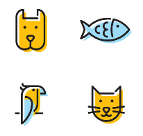

## Case Study: Pet Products Subscription 

### Table of Contents
- [Business task](https://github.com/vanessa-ip/pet-product-subscription#business-task)
- [Case study questions](https://github.com/vanessa-ip/pet-product-subscription#case-study-questions)
- [Solutions on Github](https://github.com/vanessa-ip/pet-product-subscription/blob/main/pet-products-analysis.ipynb)

### Business Task
PetMind is a nationwide pet product retailer in the United States. With inflation hitting 41-year highs, the company is planning to reduce the cost of customer retention by improving brand loyalty. The first strategy is to launch a monthly pet box subscription in three months.
The marketing team is preparing a list of popular products for the subscription. The chief marketing officer wants to know whether the list should only include the products being purchased more than once.

### Case study questions

1. How many products are being purchased more than once?
2. Do the products being purchased again have better sales than others?
3. Is there a statistical difference in sales, units solds, and rating between rebuy and not-rebuy products?
4. For each pet type, what is the percentage of rebuy products in the top 50 sales? 
5. For each pet type, what is the percentage of rebuy products in the bottom 50 sales?
6. Is there a relationship between product price and number of units sold for either rebuy or not-rebuy products?
7. What products are more likely to be purchased again for different types of pets? 
8. What benchmark metrics should be used in combination to determine which products are more likely to be purchased again for different types of pets?

